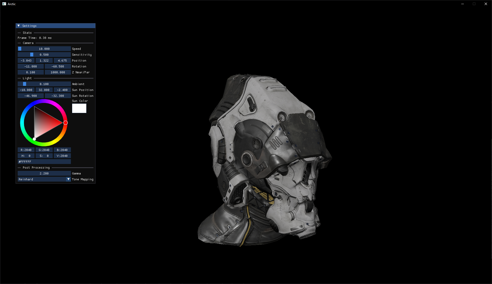
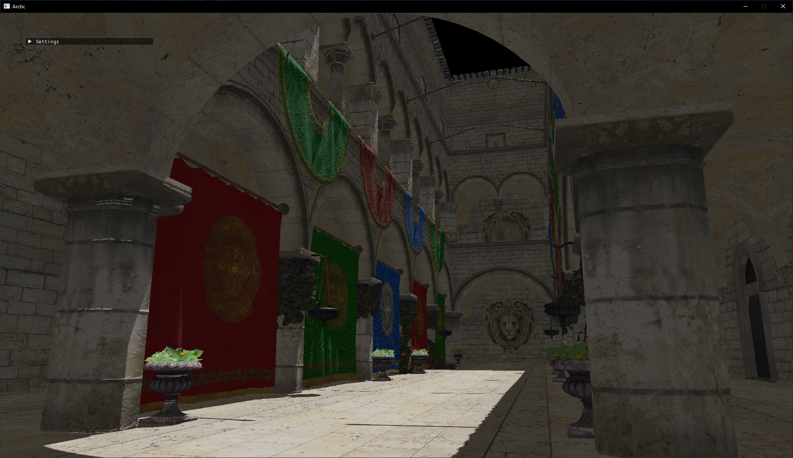
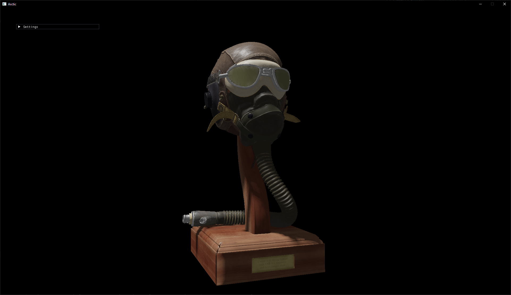

# Arctic

A custom render engine written from scratch using DirectX 12.

> [!IMPORTANT]
> This project is still under heavy development and is most likely buggy.

## Features
- [x] PBR forward render pipeline
- [x] Global directional light with shadow map
- [x] Configurable point lights (no shadows yet)
- [x] Load scene (meshes, textures) from glTF or similar formats
- [x] HDR tonemapping (Reinhard, simple exposure, ACES approximation)
- [x] Configurable gamma correction
- [ ] IBL with skybox
- [ ] Spotlights
- [ ] Point light shadows
- [ ] More complex light/scene editor
- [ ] Raytracing

## Screenshots

The models used in the screenshots can be found at https://github.com/KhronosGroup/glTF-Sample-Assets .
